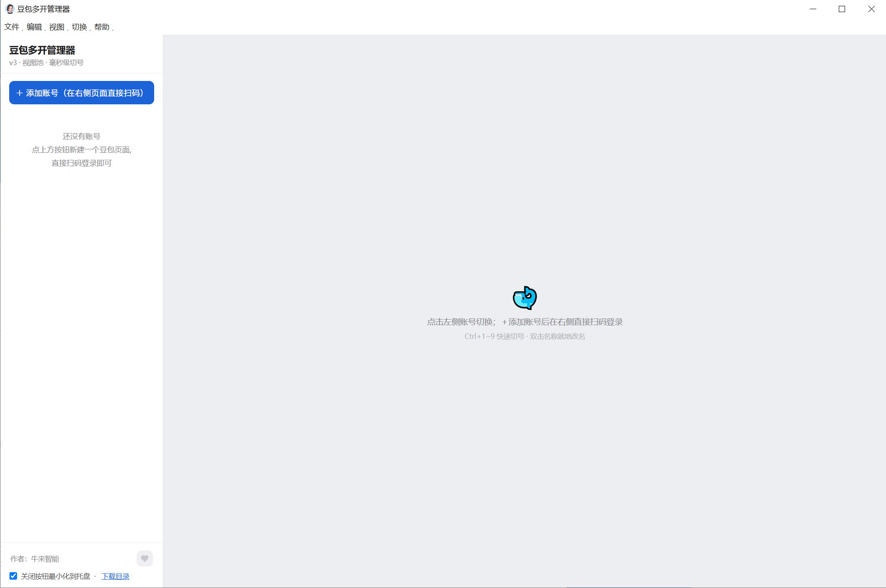

# 豆包多开管理器

  

一个本地豆包（Doubao）多账号管理器：单窗口内嵌多个**常驻豆包页面**，
切号即显隐切换 —— **毫秒级、不丢状态、所有账号同时在线**。



## 原理

- Electron 单窗口 + `WebContentsView` 常驻视图池
- 每个账号一个 `persist:<id>` 分区会话 → Cookie / 存储完全隔离
- 不修改豆包官方任何文件；页面加载自 `www.doubao.com`，官方更新自动兼容

## 功能

- **一键切号**：侧栏点击 / 托盘菜单 / `Ctrl+1~9`
- **添加账号**：点 ＋ 后直接在右侧页面扫码，登录成功自动转正
- **自动识别昵称**：登录后自动重放官方用户信息接口读取昵称并改名（只改默认名，不覆盖手动修改）
- **双击就地改名**：双击侧栏名称原地编辑，Enter 保存 / Esc 取消
- **掉线检测**：强凭证 Cookie 定期校验，掉线徽标变红提示重新登录
- **稳定性**：渲染进程崩溃自动重建视图；页面加载失败自动重试；单实例锁；记住窗口位置
- **下载处理**：生成的视频/图片自动保存到 `downloads\<账号ID>\` 并弹提示
- **支持作者**：侧栏左下角点爱心，扫码请作者喝杯咖啡

## 快捷键

| 快捷键 | 功能 |
|---|---|
| `Ctrl+N` | 添加账号 |
| `Ctrl+1~9` | 切换到第 N 个账号 |
| `Ctrl+R` | 重新加载当前页 |
| `Ctrl+= / Ctrl+- / Ctrl+0` | 页面放大 / 缩小 / 实际大小 |
| `Ctrl+Shift+Q` | 退出程序 |

## 目录结构

```
doubaoduokai\
├─ main.js              主进程(视图池/会话隔离/托盘/IPC)
├─ preload.js           IPC 安全桥
├─ index.html           侧栏界面
├─ renderer.js          界面逻辑
├─ support.html/js      支持作者窗口
├─ package.json         依赖声明(electron)
├─ .npmrc               国内镜像配置
├─ 启动豆包多开.bat      启动入口(自动清环境变量/缺依赖时自动安装)
├─ app.ico              应用图标
├─ .gitignore           隐私数据与依赖忽略清单
├─ assets\              收款码图片(wechat.png / alipay.png)
└─ README.md            本文件

运行时自动生成(已被 .gitignore 排除):
├─ userdata\            各账号分区会话数据(含登录态,勿外传)
├─ downloads\           生成的视频图片落盘处
└─ app-run.log          运行日志
```

## 本地运行

1. 安装 [Node.js](https://nodejs.org) ≥ 18
2. 双击 `启动豆包多开.bat`（首次会自动 `npm install`，已配置国内镜像）
3. 或手动: `npm install && npm start`

> 依赖安装在本目录 `node_modules\`，npm 下载缓存可通过环境变量
> `npm_config_cache` / `ELECTRON_CACHE` 自定义位置，实现 C 盘零占用。

## 克隆与部署

`.gitignore` 已排除 `node_modules\`、`userdata\`（含登录凭据！）、`downloads\`、日志等。
克隆到新机器后：装好 Node.js → `npm install`（或直接双击 bat）→ 运行。

## 风险须知

工具使用 Chromium 分区会话隔离各账号，行为等同「多人共用一台电脑的浏览器」，
正常使用风险很低；但**没有任何方案能保证官方不可检测多账号**。
请勿用于批量注册、自动化群控等违反官方协议的行为。

## 许可证

[MIT](LICENSE) © 2026 牛来智能
